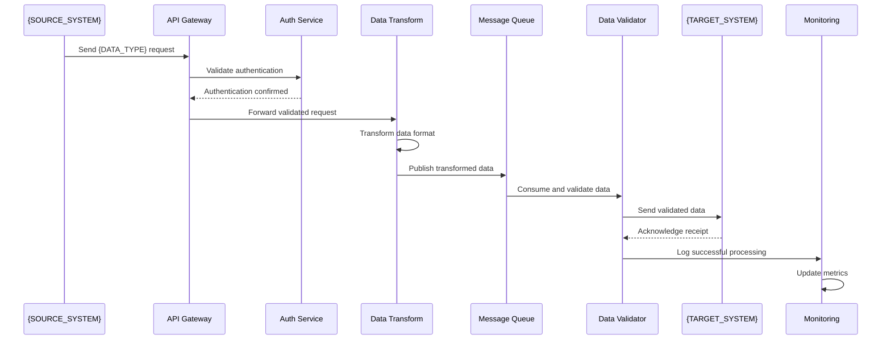
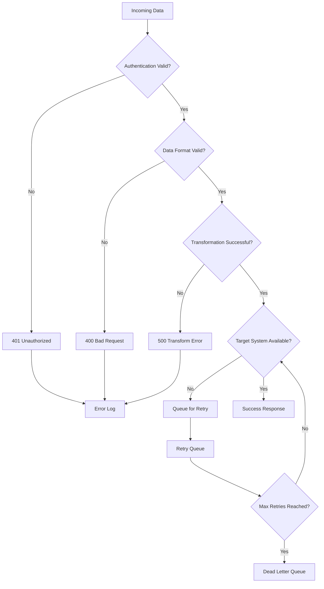
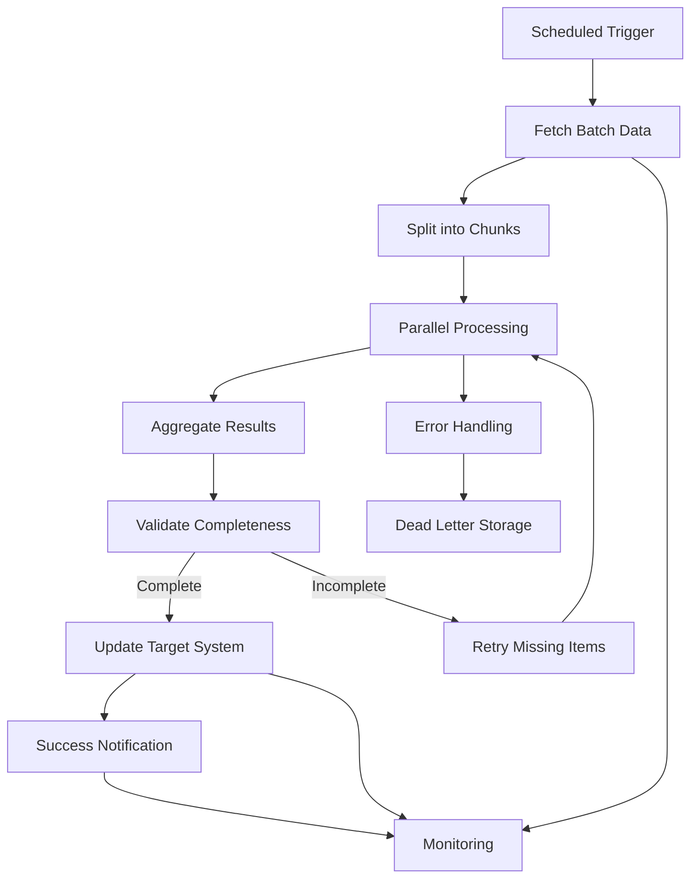
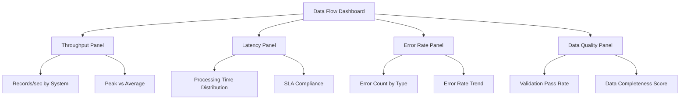

# Data Flow Diagram: {INTEGRATION_NAME}

## Overview

**Integration Name:** {INTEGRATION_NAME}  
**Version:** {VERSION}  
**Date:** {DATE}  
**Author:** {AUTHOR}  
**Systems Involved:** {SYSTEM_COUNT} systems  

### Purpose
This document describes the data flow for {INTEGRATION_PURPOSE}, including data sources, transformations, routing, and destinations.

### Scope
- Data flow between {SOURCE_SYSTEM} and {TARGET_SYSTEM}
- Data transformations and validation rules
- Error handling and recovery mechanisms
- Monitoring and observability touchpoints

## System Overview

### Participating Systems
| System | Role | Data Format | Protocol | Authentication |
|--------|------|-------------|----------|----------------|
| {SYSTEM_1} | Source/Producer | {FORMAT_1} | {PROTOCOL_1} | {AUTH_1} |
| {SYSTEM_2} | Target/Consumer | {FORMAT_2} | {PROTOCOL_2} | {AUTH_2} |
| {MIDDLEWARE} | Processor/Router | {FORMAT_3} | {PROTOCOL_3} | {AUTH_3} |

### Data Flow Architecture

```mermaid
graph TD
    A[{SOURCE_SYSTEM}] -->|{DATA_TYPE_1}| B[API Gateway]
    B --> C[Authentication Service]
    C -->|Validated Request| D[Data Transformation Service]
    D -->|{TRANSFORMED_FORMAT}| E[Message Queue]
    E --> F[Data Validation Service]
    F -->|Valid Data| G[{TARGET_SYSTEM}]
    F -->|Invalid Data| H[Error Queue]
    H --> I[Dead Letter Queue]
    
    D --> J[Monitoring Service]
    G --> J
    J --> K[Metrics & Alerts]
    
    E --> L[Audit Log]
    G --> L
```

## Detailed Data Flow

### Flow 1: {FLOW_1_NAME}

#### Flow Description
{FLOW_1_DESCRIPTION}

#### Data Journey


#### Data Transformations

##### Input Schema
```json
{
  "schema_version": "1.0",
  "source_format": "{SOURCE_FORMAT}",
  "example_input": {
    "{INPUT_FIELD_1}": "{INPUT_VALUE_1}",
    "{INPUT_FIELD_2}": {INPUT_VALUE_2},
    "{INPUT_FIELD_3}": ["{INPUT_ARRAY_VALUE_1}", "{INPUT_ARRAY_VALUE_2}"],
    "metadata": {
      "timestamp": "2023-12-01T12:00:00Z",
      "source": "{SOURCE_SYSTEM}",
      "correlation_id": "uuid"
    }
  }
}
```

##### Transformation Rules
| Source Field | Target Field | Transformation Rule | Validation |
|--------------|--------------|-------------------|------------|
| {SOURCE_FIELD_1} | {TARGET_FIELD_1} | {TRANSFORMATION_RULE_1} | {VALIDATION_RULE_1} |
| {SOURCE_FIELD_2} | {TARGET_FIELD_2} | {TRANSFORMATION_RULE_2} | {VALIDATION_RULE_2} |
| {SOURCE_FIELD_3} | {TARGET_FIELD_3} | {TRANSFORMATION_RULE_3} | {VALIDATION_RULE_3} |

##### Output Schema
```json
{
  "schema_version": "1.0",
  "target_format": "{TARGET_FORMAT}",
  "example_output": {
    "{OUTPUT_FIELD_1}": "{OUTPUT_VALUE_1}",
    "{OUTPUT_FIELD_2}": {OUTPUT_VALUE_2},
    "{OUTPUT_FIELD_3}": {OUTPUT_VALUE_3},
    "audit": {
      "processed_at": "2023-12-01T12:00:01Z",
      "transformation_version": "1.2.3",
      "correlation_id": "uuid"
    }
  }
}
```

#### Error Handling

##### Error Scenarios


##### Error Classification
| Error Type | HTTP Status | Action | Retry Policy |
|-----------|-------------|--------|--------------|
| Authentication Failure | 401 | Log & Reject | No Retry |
| Invalid Data Format | 400 | Log & Reject | No Retry |
| Transformation Error | 500 | Log & Queue | Exponential Backoff |
| Target System Unavailable | 503 | Queue for Retry | Linear Backoff |
| Rate Limit Exceeded | 429 | Respect Retry-After | Header-Based Retry |

### Flow 2: {FLOW_2_NAME}

#### Flow Description
{FLOW_2_DESCRIPTION}

#### Batch Processing Flow


#### Processing Configuration
```yaml
batch_processing:
  schedule: "{BATCH_SCHEDULE}" # e.g., "0 */6 * * *" (every 6 hours)
  chunk_size: {CHUNK_SIZE} # records per batch
  parallel_workers: {WORKER_COUNT}
  timeout_minutes: {PROCESSING_TIMEOUT}
  retry_policy:
    max_attempts: {MAX_ATTEMPTS}
    backoff_strategy: "{BACKOFF_STRATEGY}"
    base_delay_seconds: {BASE_DELAY}
```

## Data Quality and Validation

### Validation Rules

#### Data Integrity Checks
| Field | Validation Rule | Error Action | Impact |
|-------|----------------|--------------|--------|
| {FIELD_1} | {VALIDATION_1} | {ERROR_ACTION_1} | {IMPACT_1} |
| {FIELD_2} | {VALIDATION_2} | {ERROR_ACTION_2} | {IMPACT_2} |
| {FIELD_3} | {VALIDATION_3} | {ERROR_ACTION_3} | {IMPACT_3} |

#### Business Rule Validation
```javascript
// Example validation logic
const businessRules = {
  validateOrder: (order) => {
    const errors = [];
    
    // Rule 1: Order total must match item sum
    const itemSum = order.items.reduce((sum, item) => sum + item.price * item.quantity, 0);
    if (Math.abs(order.total - itemSum) > 0.01) {
      errors.push('Order total does not match item sum');
    }
    
    // Rule 2: Customer must exist and be active
    if (!order.customer_id || !isCustomerActive(order.customer_id)) {
      errors.push('Invalid or inactive customer');
    }
    
    // Rule 3: All items must be in stock
    const outOfStockItems = order.items.filter(item => !isInStock(item.product_id, item.quantity));
    if (outOfStockItems.length > 0) {
      errors.push(`Out of stock items: ${outOfStockItems.map(i => i.product_id).join(', ')}`);
    }
    
    return errors;
  }
};
```

### Data Quality Metrics
| Metric | Target | Measurement | Alert Threshold |
|--------|--------|-------------|-----------------|
| Data Completeness | > 99% | Field population rate | < 95% |
| Data Accuracy | > 99.5% | Validation pass rate | < 98% |
| Data Freshness | < 5 minutes | Time since last update | > 15 minutes |
| Data Consistency | > 99.9% | Cross-system validation | < 99% |

## Monitoring and Observability

### Key Metrics

#### Data Flow Metrics
```yaml
metrics:
  throughput:
    - name: "records_per_second"
      description: "Data records processed per second"
      type: "gauge"
      labels: ["source_system", "target_system", "data_type"]
  
  latency:
    - name: "end_to_end_processing_time"
      description: "Time from data ingestion to target delivery"
      type: "histogram" 
      buckets: [100, 500, 1000, 5000, 10000] # milliseconds
  
  data_quality:
    - name: "validation_failures"
      description: "Number of records failing validation"
      type: "counter"
      labels: ["validation_rule", "severity"]
  
  errors:
    - name: "processing_errors"
      description: "Errors during data processing"
      type: "counter"
      labels: ["error_type", "component"]
```

#### Monitoring Dashboard



### Alerting Rules

#### Critical Alerts
```yaml
critical_alerts:
  - name: "data_flow_stopped"
    condition: "rate(records_processed[5m]) == 0"
    duration: "2m"
    action: "page_oncall_team"
    
  - name: "high_error_rate"
    condition: "rate(processing_errors[5m]) > 0.05"
    duration: "1m"
    action: "page_oncall_team"
    
  - name: "sla_breach"
    condition: "histogram_quantile(0.95, processing_time) > 30000" # 30 seconds
    duration: "5m"
    action: "notify_team"
```

#### Warning Alerts
```yaml
warning_alerts:
  - name: "data_quality_degradation"
    condition: "validation_pass_rate < 0.95"
    duration: "5m"
    action: "notify_team"
    
  - name: "queue_backlog_growing"
    condition: "queue_depth > 1000"
    duration: "10m"
    action: "notify_team"
```

## Security Considerations

### Data Protection

#### Encryption
- **In Transit:** TLS 1.3 for all API communications
- **At Rest:** AES-256 for data storage
- **Key Management:** {KEY_MANAGEMENT_SOLUTION}

#### Access Controls
```yaml
access_controls:
  authentication:
    method: "{AUTH_METHOD}" # OAuth 2.0, API Key, mTLS
    token_expiry: "{TOKEN_EXPIRY}"
    refresh_policy: "{REFRESH_POLICY}"
  
  authorization:
    model: "RBAC" # Role-Based Access Control
    roles:
      - name: "data_producer"
        permissions: ["write:data", "read:status"]
      - name: "data_consumer"
        permissions: ["read:data", "read:status"]
      - name: "system_admin"
        permissions: ["*"]
```

#### Data Masking
| Data Type | Masking Strategy | Example |
|-----------|------------------|---------|
| PII (Email) | {MASKING_STRATEGY_1} | user@example.com → u***@example.com |
| PII (Phone) | {MASKING_STRATEGY_2} | +1234567890 → +1234***890 |
| Financial | {MASKING_STRATEGY_3} | 1234-5678-9012-3456 → ****-****-****-3456 |

### Compliance Requirements

#### Audit Logging
```yaml
audit_logging:
  events_to_log:
    - data_access
    - data_modification
    - authentication_events
    - authorization_failures
    - configuration_changes
  
  log_retention: "{LOG_RETENTION_PERIOD}"
  log_storage: "{LOG_STORAGE_LOCATION}"
  log_format: "JSON"
  
  required_fields:
    - timestamp
    - user_id
    - action
    - resource
    - source_ip
    - correlation_id
```

## Performance Optimization

### Scaling Strategies

#### Horizontal Scaling
```yaml
scaling_configuration:
  auto_scaling:
    enabled: true
    min_replicas: {MIN_REPLICAS}
    max_replicas: {MAX_REPLICAS}
    target_cpu_utilization: {CPU_TARGET}%
    target_memory_utilization: {MEMORY_TARGET}%
  
  load_balancing:
    algorithm: "{LB_ALGORITHM}" # round_robin, least_connections, weighted
    health_checks:
      interval: "{HEALTH_CHECK_INTERVAL}"
      timeout: "{HEALTH_CHECK_TIMEOUT}"
      healthy_threshold: {HEALTHY_THRESHOLD}
```

#### Performance Tuning
| Component | Optimization | Configuration | Expected Impact |
|-----------|--------------|---------------|-----------------|
| Message Queue | Partitioning | {PARTITION_COUNT} partitions | +{THROUGHPUT_IMPROVEMENT}% throughput |
| Database | Indexing | Index on {INDEX_FIELDS} | -{LATENCY_REDUCTION}% query time |
| Cache | Redis Cluster | {CACHE_SIZE}GB cluster | +{HIT_RATE}% cache hit rate |

## Disaster Recovery

### Backup Strategy
```yaml
backup_strategy:
  data_backup:
    frequency: "{BACKUP_FREQUENCY}"
    retention: "{BACKUP_RETENTION}"
    storage_locations:
      - primary: "{PRIMARY_BACKUP_LOCATION}"
      - secondary: "{SECONDARY_BACKUP_LOCATION}"
  
  configuration_backup:
    frequency: "on_change"
    version_control: true
    storage: "{CONFIG_BACKUP_LOCATION}"
```

### Recovery Procedures

#### Recovery Time Objectives (RTO)
| Component | RTO | Recovery Steps |
|-----------|-----|----------------|
| API Gateway | < 5 minutes | {RECOVERY_STEPS_1} |
| Data Processing | < 15 minutes | {RECOVERY_STEPS_2} |
| Database | < 30 minutes | {RECOVERY_STEPS_3} |

#### Recovery Point Objectives (RPO)
| Data Type | RPO | Backup Frequency |
|-----------|-----|-----------------|
| Transactional Data | < 1 minute | Real-time replication |
| Configuration Data | < 5 minutes | Change-based backup |
| Log Data | < 15 minutes | Batched backup |

## Implementation Checklist

### Pre-Implementation
- [ ] Requirements validation completed
- [ ] Security review approved
- [ ] Performance benchmarks established
- [ ] Test environment configured
- [ ] Monitoring dashboards created

### Implementation Phase
- [ ] API endpoints developed and tested
- [ ] Data transformation logic implemented
- [ ] Error handling mechanisms deployed
- [ ] Security controls configured
- [ ] Performance optimization applied

### Post-Implementation
- [ ] Production deployment completed
- [ ] Monitoring alerts configured
- [ ] Documentation updated
- [ ] Team training conducted
- [ ] Operational runbooks created

## Troubleshooting Guide

### Common Issues
| Issue | Symptoms | Root Cause | Resolution |
|-------|----------|------------|------------|
| Data Loss | Missing records in target | {ROOT_CAUSE_1} | {RESOLUTION_1} |
| High Latency | Processing time > SLA | {ROOT_CAUSE_2} | {RESOLUTION_2} |
| Transformation Errors | Invalid output format | {ROOT_CAUSE_3} | {RESOLUTION_3} |

### Diagnostic Commands
```bash
# Check data flow health
curl -X GET "https://api.example.com/health" \
  -H "Authorization: Bearer $TOKEN"

# Monitor queue depth
kubectl get pods -l app=message-queue -o wide

# View transformation logs
kubectl logs -f deployment/data-transformer --tail=100

# Check error rates
curl -X GET "https://monitoring.example.com/api/v1/query?query=rate(errors[5m])"
```

## References and Links

### Documentation
- [API Reference Documentation]({API_DOCS_URL})
- [System Architecture Overview]({ARCHITECTURE_URL})
- [Runbook Collection]({RUNBOOK_URL})

### Configuration Files
- [API Gateway Config]({CONFIG_FILE_1_URL})
- [Message Queue Config]({CONFIG_FILE_2_URL})
- [Monitoring Config]({CONFIG_FILE_3_URL})

### Related Documents
- [ADR-{ADR_NUMBER}: {ADR_TITLE}]({ADR_URL})
- [Integration Test Plan]({TEST_PLAN_URL})
- [Security Assessment]({SECURITY_ASSESSMENT_URL})