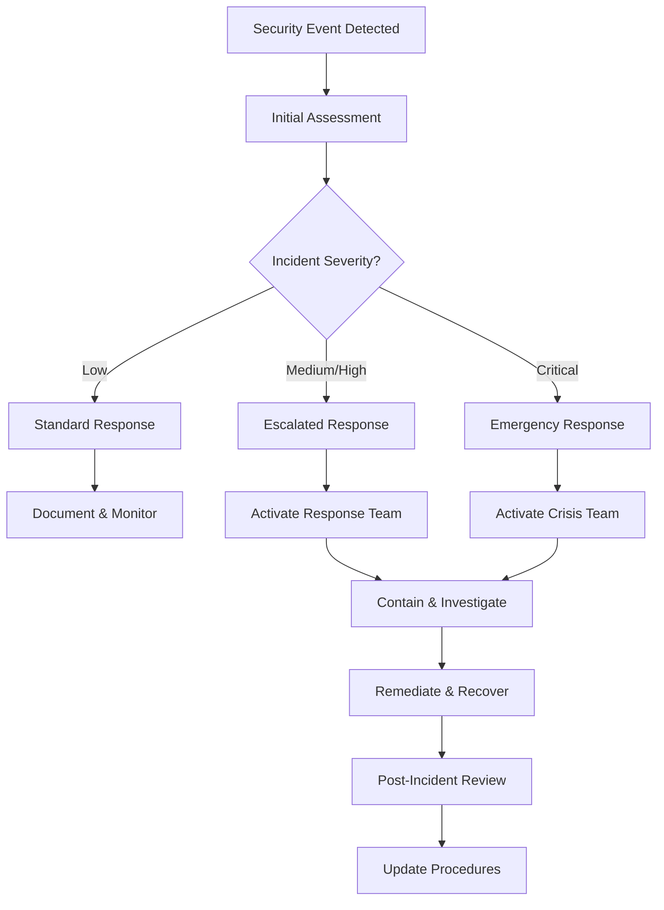

# Integration Security Assessment: {INTEGRATION_NAME}

## Assessment Overview

**Integration Name:** {INTEGRATION_NAME}  
**Assessment Date:** {ASSESSMENT_DATE}  
**Assessor:** {ASSESSOR_NAME}  
**Version:** {VERSION}  
**Classification:** {SECURITY_CLASSIFICATION}  

### Executive Summary
{EXECUTIVE_SUMMARY}

**Security Posture:** {SECURITY_POSTURE} (Low Risk / Medium Risk / High Risk)  
**Critical Vulnerabilities:** {CRITICAL_COUNT}  
**High Risk Issues:** {HIGH_RISK_COUNT}  
**Compliance Status:** {COMPLIANCE_STATUS}  

### Assessment Scope
- **Systems in Scope:** {SYSTEMS_IN_SCOPE}
- **Data Types:** {DATA_TYPES}
- **Integration Protocols:** {PROTOCOLS}
- **Assessment Period:** {ASSESSMENT_PERIOD}

## Threat Modeling

### Assets Inventory
| Asset | Classification | Value | Threat Actors | Impact Rating |
|-------|---------------|-------|---------------|---------------|
| {ASSET_1} | {CLASSIFICATION_1} | {VALUE_1} | {THREAT_ACTORS_1} | {IMPACT_1} |
| {ASSET_2} | {CLASSIFICATION_2} | {VALUE_2} | {THREAT_ACTORS_2} | {IMPACT_2} |
| {ASSET_3} | {CLASSIFICATION_3} | {VALUE_3} | {THREAT_ACTORS_3} | {IMPACT_3} |

### Threat Analysis

#### STRIDE Threat Model
```yaml
threats:
  spoofing:
    - threat: "Attacker impersonates legitimate system"
      impact: "High"
      likelihood: "Medium"
      controls: ["mTLS", "API_key_validation", "IP_whitelisting"]
  
  tampering:
    - threat: "Data modification in transit"
      impact: "High" 
      likelihood: "Low"
      controls: ["TLS_encryption", "message_signing", "integrity_checks"]
  
  repudiation:
    - threat: "Denial of actions performed"
      impact: "Medium"
      likelihood: "Low"
      controls: ["audit_logging", "digital_signatures", "non_repudiation"]
  
  information_disclosure:
    - threat: "Unauthorized data access"
      impact: "High"
      likelihood: "Medium"
      controls: ["encryption", "access_controls", "data_masking"]
  
  denial_of_service:
    - threat: "Service availability attacks"
      impact: "Medium"
      likelihood: "High"
      controls: ["rate_limiting", "circuit_breakers", "load_balancing"]
  
  elevation_of_privilege:
    - threat: "Unauthorized access escalation"
      impact: "High"
      likelihood: "Low"
      controls: ["RBAC", "principle_of_least_privilege", "regular_access_reviews"]
```

### Attack Vectors

#### Network-based Attacks
| Attack Type | Vector | Probability | Impact | Mitigation |
|-------------|--------|-------------|---------|------------|
| Man-in-the-Middle | {MITM_VECTOR} | {MITM_PROB} | {MITM_IMPACT} | {MITM_MITIGATION} |
| DDoS | {DDOS_VECTOR} | {DDOS_PROB} | {DDOS_IMPACT} | {DDOS_MITIGATION} |
| API Abuse | {API_VECTOR} | {API_PROB} | {API_IMPACT} | {API_MITIGATION} |

#### Application-based Attacks
| Attack Type | Vector | Probability | Impact | Mitigation |
|-------------|--------|-------------|---------|------------|
| Injection Attacks | {INJECTION_VECTOR} | {INJECTION_PROB} | {INJECTION_IMPACT} | {INJECTION_MITIGATION} |
| Authentication Bypass | {AUTH_VECTOR} | {AUTH_PROB} | {AUTH_IMPACT} | {AUTH_MITIGATION} |
| Data Leakage | {LEAK_VECTOR} | {LEAK_PROB} | {LEAK_IMPACT} | {LEAK_MITIGATION} |

## Authentication and Authorization

### Authentication Mechanisms

#### Primary Authentication
```yaml
authentication:
  method: "{AUTH_METHOD}" # OAuth2, JWT, API_Key, mTLS
  provider: "{AUTH_PROVIDER}"
  token_format: "{TOKEN_FORMAT}"
  
  configuration:
    token_expiry: "{TOKEN_EXPIRY}"
    refresh_enabled: {REFRESH_ENABLED}
    multi_factor_required: {MFA_REQUIRED}
    
  validation_rules:
    - issuer_validation: true
    - audience_validation: true
    - signature_verification: true
    - expiry_check: true
```

#### Multi-Factor Authentication
| Factor Type | Implementation | Mandatory For | Backup Method |
|-------------|---------------|---------------|---------------|
| Something you know | {KNOWLEDGE_FACTOR} | {KNOWLEDGE_MANDATORY} | {KNOWLEDGE_BACKUP} |
| Something you have | {POSSESSION_FACTOR} | {POSSESSION_MANDATORY} | {POSSESSION_BACKUP} |
| Something you are | {INHERENCE_FACTOR} | {INHERENCE_MANDATORY} | {INHERENCE_BACKUP} |

### Authorization Model

#### Role-Based Access Control (RBAC)
```yaml
rbac_model:
  roles:
    - name: "integration_admin"
      description: "Full integration management access"
      permissions:
        - "integration:*"
        - "monitoring:read"
        - "logs:read"
    
    - name: "data_producer"
      description: "Can send data to integration endpoints"
      permissions:
        - "integration:write"
        - "integration:read:own"
    
    - name: "data_consumer"
      description: "Can receive data from integration endpoints"
      permissions:
        - "integration:read"
        - "webhooks:register"
    
    - name: "monitoring_user"
      description: "Read-only access to monitoring and logs"
      permissions:
        - "monitoring:read"
        - "logs:read"
        - "metrics:read"
```

#### Permission Matrix
| Resource | Admin | Producer | Consumer | Monitor |
|----------|-------|----------|----------|---------|
| Create Integration | ✓ | ✗ | ✗ | ✗ |
| Modify Integration | ✓ | ✗ | ✗ | ✗ |
| Send Data | ✓ | ✓ | ✗ | ✗ |
| Receive Data | ✓ | ✗ | ✓ | ✗ |
| View Metrics | ✓ | ✓ | ✓ | ✓ |
| Access Logs | ✓ | Limited | Limited | ✓ |

## Encryption and Data Protection

### Encryption Standards

#### Data in Transit
```yaml
encryption_in_transit:
  protocol: "TLS 1.3"
  cipher_suites:
    - "TLS_AES_256_GCM_SHA384"
    - "TLS_CHACHA20_POLY1305_SHA256"
    - "TLS_AES_128_GCM_SHA256"
  
  certificate_management:
    provider: "{CERT_PROVIDER}"
    rotation_policy: "{CERT_ROTATION}"
    validation_checks:
      - certificate_chain_verification
      - hostname_verification
      - certificate_revocation_check
```

#### Data at Rest
```yaml
encryption_at_rest:
  algorithm: "AES-256-GCM"
  key_management:
    provider: "{KMS_PROVIDER}" # AWS KMS, Azure Key Vault, HashiCorp Vault
    key_rotation: "{KEY_ROTATION_SCHEDULE}"
    backup_keys: "{BACKUP_KEY_STRATEGY}"
  
  encrypted_components:
    - database_storage
    - message_queue_storage
    - log_files
    - backup_files
    - configuration_files_with_secrets
```

### Key Management

#### Key Lifecycle Management
| Stage | Process | Responsibility | Frequency |
|-------|---------|---------------|-----------|
| Key Generation | {KEY_GENERATION_PROCESS} | {KEY_GEN_OWNER} | {KEY_GEN_FREQUENCY} |
| Key Distribution | {KEY_DISTRIBUTION_PROCESS} | {KEY_DIST_OWNER} | As needed |
| Key Rotation | {KEY_ROTATION_PROCESS} | {KEY_ROTATION_OWNER} | {KEY_ROTATION_SCHEDULE} |
| Key Revocation | {KEY_REVOCATION_PROCESS} | {KEY_REVOKE_OWNER} | As needed |
| Key Destruction | {KEY_DESTRUCTION_PROCESS} | {KEY_DESTROY_OWNER} | End of lifecycle |

#### Key Security Controls
```yaml
key_security:
  storage:
    location: "HSM" # Hardware Security Module
    backup_location: "Encrypted_offline_storage"
    access_controls: "Multi_person_authorization"
  
  usage:
    minimum_key_length: 256
    key_separation: "Development_and_production_keys_separate"
    audit_logging: "All_key_operations_logged"
  
  compliance:
    standards: ["FIPS_140-2_Level_3", "Common_Criteria_EAL4+"]
    certifications: ["{CERTIFICATION_1}", "{CERTIFICATION_2}"]
```

## Input Validation and Sanitization

### Validation Framework

#### Input Validation Rules
```yaml
validation_rules:
  data_types:
    string:
      max_length: {MAX_STRING_LENGTH}
      allowed_characters: "{ALLOWED_CHARS_PATTERN}"
      encoding: "UTF-8"
      
    numeric:
      range_min: {NUMERIC_MIN}
      range_max: {NUMERIC_MAX}
      decimal_places: {DECIMAL_PLACES}
      
    date_time:
      format: "ISO 8601"
      timezone_handling: "UTC_conversion"
      range_validation: "Future_dates_allowed"
  
  business_rules:
    - rule: "Email format validation"
      pattern: "^[a-zA-Z0-9._%+-]+@[a-zA-Z0-9.-]+\\.[a-zA-Z]{2,}$"
      
    - rule: "Phone number validation"
      pattern: "^\\+?[1-9]\\d{1,14}$"
      
    - rule: "Currency amount validation"
      pattern: "^\\d+\\.\\d{2}$"
      range: "0.01 to 999999999.99"
```

#### Sanitization Procedures
| Input Type | Sanitization Method | Security Benefit |
|------------|-------------------|------------------|
| User Input | {SANITIZATION_1} | Prevents XSS attacks |
| File Names | {SANITIZATION_2} | Prevents path traversal |
| SQL Parameters | {SANITIZATION_3} | Prevents SQL injection |
| Command Parameters | {SANITIZATION_4} | Prevents command injection |

### Content Security

#### File Upload Security
```yaml
file_upload_security:
  allowed_types:
    - "application/json"
    - "text/csv"
    - "application/xml"
    
  size_limits:
    max_file_size: "{MAX_FILE_SIZE}MB"
    max_total_size: "{MAX_TOTAL_SIZE}MB"
    
  scanning:
    virus_scanning: true
    malware_detection: true
    content_validation: true
    
  storage:
    quarantine_period: "{QUARANTINE_PERIOD}"
    secure_storage_location: "{SECURE_STORAGE}"
    access_logging: true
```

## API Security

### API Protection Mechanisms

#### Rate Limiting
```yaml
rate_limiting:
  global_limits:
    requests_per_minute: {GLOBAL_RPM}
    requests_per_hour: {GLOBAL_RPH}
    burst_capacity: {GLOBAL_BURST}
  
  per_client_limits:
    authenticated_users:
      requests_per_minute: {AUTH_RPM}
      requests_per_hour: {AUTH_RPH}
      
    anonymous_users:
      requests_per_minute: {ANON_RPM}
      requests_per_hour: {ANON_RPH}
  
  enforcement:
    algorithm: "Token bucket"
    response_code: 429
    retry_after_header: true
    
  exceptions:
    health_checks: true
    internal_services: true
```

#### API Gateway Security
```yaml
api_gateway_security:
  request_filtering:
    - sql_injection_protection: true
    - xss_protection: true
    - oversized_request_rejection: true
    - malformed_request_rejection: true
  
  response_filtering:
    - sensitive_data_masking: true
    - error_message_sanitization: true
    - security_headers_injection: true
  
  logging:
    - request_response_logging: true
    - sensitive_data_redaction: true
    - correlation_id_injection: true
```

### API Security Headers
| Header | Value | Purpose |
|--------|-------|---------|
| X-Content-Type-Options | nosniff | Prevent MIME type sniffing |
| X-Frame-Options | DENY | Prevent clickjacking |
| X-XSS-Protection | 1; mode=block | XSS protection |
| Strict-Transport-Security | max-age=31536000 | Force HTTPS |
| Content-Security-Policy | {CSP_POLICY} | Control resource loading |

## Monitoring and Logging

### Security Monitoring

#### Security Events to Monitor
```yaml
security_monitoring:
  authentication_events:
    - successful_login
    - failed_login_attempts
    - account_lockouts
    - password_reset_requests
    - multi_factor_auth_failures
  
  authorization_events:
    - permission_denied_attempts
    - privilege_escalation_attempts
    - role_changes
    - access_pattern_anomalies
  
  data_access_events:
    - sensitive_data_access
    - bulk_data_exports
    - unusual_query_patterns
    - after_hours_access
  
  system_events:
    - configuration_changes
    - system_errors
    - performance_anomalies
    - resource_exhaustion
```

#### Security Metrics and KPIs
| Metric | Target | Measurement | Alert Threshold |
|--------|--------|-------------|-----------------|
| Authentication Success Rate | > 99% | Successful logins / Total attempts | < 95% |
| Failed Login Rate | < 1% | Failed logins / Total attempts | > 5% |
| Anomalous Access Patterns | 0 | ML-based detection | Any detection |
| Security Incident MTTR | < 4 hours | Time to resolve | > 8 hours |

### Audit Logging

#### Audit Log Requirements
```yaml
audit_logging:
  log_format: "JSON"
  timestamp_format: "ISO 8601 UTC"
  
  required_fields:
    - event_timestamp
    - event_type
    - user_identifier
    - source_ip_address
    - user_agent
    - resource_accessed
    - action_performed
    - outcome_status
    - correlation_id
    - session_id
  
  sensitive_data_handling:
    - pii_redaction: true
    - credential_masking: true
    - tokenization: true
    
  retention_policy:
    standard_logs: "{STANDARD_RETENTION}"
    security_logs: "{SECURITY_RETENTION}"
    compliance_logs: "{COMPLIANCE_RETENTION}"
```

#### Log Protection
| Protection Measure | Implementation | Verification |
|-------------------|---------------|--------------|
| Log Integrity | {LOG_INTEGRITY_METHOD} | {INTEGRITY_VERIFICATION} |
| Log Encryption | {LOG_ENCRYPTION_METHOD} | {ENCRYPTION_VERIFICATION} |
| Access Control | {LOG_ACCESS_CONTROL} | {ACCESS_VERIFICATION} |
| Backup | {LOG_BACKUP_STRATEGY} | {BACKUP_VERIFICATION} |

## Vulnerability Assessment

### Security Testing Results

#### Automated Security Scanning
| Tool | Scan Type | Vulnerabilities Found | Risk Level |
|------|-----------|---------------------|------------|
| {SAST_TOOL} | Static Analysis | {SAST_FINDINGS} | {SAST_RISK} |
| {DAST_TOOL} | Dynamic Analysis | {DAST_FINDINGS} | {DAST_RISK} |
| {DEPENDENCY_SCANNER} | Dependency Scan | {DEP_FINDINGS} | {DEP_RISK} |
| {CONTAINER_SCANNER} | Container Scan | {CONTAINER_FINDINGS} | {CONTAINER_RISK} |

#### Penetration Testing Results
```yaml
penetration_testing:
  test_date: "{PENTEST_DATE}"
  tester: "{PENTEST_COMPANY}"
  scope: "{PENTEST_SCOPE}"
  
  findings:
    critical: {CRITICAL_FINDINGS}
    high: {HIGH_FINDINGS}
    medium: {MEDIUM_FINDINGS}
    low: {LOW_FINDINGS}
    
  key_vulnerabilities:
    - vulnerability: "{VULN_1}"
      cvss_score: {CVSS_1}
      status: "{STATUS_1}"
      remediation: "{REMEDIATION_1}"
      
    - vulnerability: "{VULN_2}"
      cvss_score: {CVSS_2}
      status: "{STATUS_2}"
      remediation: "{REMEDIATION_2}"
```

### Vulnerability Management

#### Remediation Timeline
| Severity | SLA | Remediation Process | Verification |
|----------|-----|-------------------|--------------|
| Critical | 24 hours | {CRITICAL_PROCESS} | {CRITICAL_VERIFICATION} |
| High | 7 days | {HIGH_PROCESS} | {HIGH_VERIFICATION} |
| Medium | 30 days | {MEDIUM_PROCESS} | {MEDIUM_VERIFICATION} |
| Low | 90 days | {LOW_PROCESS} | {LOW_VERIFICATION} |

## Compliance Assessment

### Regulatory Compliance

#### GDPR Compliance
```yaml
gdpr_compliance:
  data_protection_principles:
    lawfulness: "{LAWFULNESS_BASIS}"
    purpose_limitation: "{PURPOSE_LIMITATION}"
    data_minimization: "{DATA_MINIMIZATION}"
    accuracy: "{ACCURACY_MEASURES}"
    storage_limitation: "{STORAGE_LIMITATION}"
    security: "{SECURITY_MEASURES}"
    
  data_subject_rights:
    - right: "Access"
      implementation: "{ACCESS_IMPLEMENTATION}"
      response_time: "30 days"
      
    - right: "Rectification" 
      implementation: "{RECTIFICATION_IMPLEMENTATION}"
      response_time: "30 days"
      
    - right: "Erasure"
      implementation: "{ERASURE_IMPLEMENTATION}"
      response_time: "30 days"
      
    - right: "Portability"
      implementation: "{PORTABILITY_IMPLEMENTATION}"
      response_time: "30 days"
```

#### Industry Standards Compliance
| Standard | Compliance Status | Gap Analysis | Remediation Plan |
|----------|------------------|--------------|------------------|
| ISO 27001 | {ISO27001_STATUS} | {ISO27001_GAPS} | {ISO27001_PLAN} |
| SOC 2 Type II | {SOC2_STATUS} | {SOC2_GAPS} | {SOC2_PLAN} |
| PCI DSS | {PCI_STATUS} | {PCI_GAPS} | {PCI_PLAN} |
| HIPAA | {HIPAA_STATUS} | {HIPAA_GAPS} | {HIPAA_PLAN} |

## Incident Response

### Security Incident Classification

#### Incident Severity Matrix
| Impact / Probability | Low | Medium | High | Critical |
|---------------------|-----|--------|------|----------|
| **High Impact** | Medium | High | Critical | Critical |
| **Medium Impact** | Low | Medium | High | Critical |
| **Low Impact** | Low | Low | Medium | High |

#### Incident Types
```yaml
incident_types:
  data_breach:
    definition: "Unauthorized access to sensitive data"
    response_team: ["Security_Lead", "Legal", "Privacy_Officer", "Communications"]
    notification_requirements:
      - regulatory_authorities: "72 hours"
      - affected_individuals: "Without undue delay"
      - business_partners: "24 hours"
    
  service_disruption:
    definition: "Integration service unavailable or degraded"
    response_team: ["Operations_Lead", "Development_Team", "Business_Owner"]
    notification_requirements:
      - internal_stakeholders: "Immediate"
      - external_customers: "1 hour"
    
  security_compromise:
    definition: "System compromise or unauthorized access"
    response_team: ["Security_Lead", "Operations_Lead", "Forensics_Team"]
    notification_requirements:
      - senior_management: "Immediate"
      - law_enforcement: "If required by law"
```

### Response Procedures

#### Incident Response Workflow


#### Contact Information
```yaml
emergency_contacts:
  security_team:
    - role: "Security Lead"
      name: "{SECURITY_LEAD_NAME}"
      phone: "{SECURITY_LEAD_PHONE}"
      email: "{SECURITY_LEAD_EMAIL}"
      
  incident_response:
    - role: "IR Manager"
      name: "{IR_MANAGER_NAME}"
      phone: "{IR_MANAGER_PHONE}"
      email: "{IR_MANAGER_EMAIL}"
      
  external_resources:
    - service: "Incident Response Consultant"
      company: "{IR_CONSULTANT_COMPANY}"
      phone: "{IR_CONSULTANT_PHONE}"
      contract_number: "{CONTRACT_NUMBER}"
```

## Security Controls Summary

### Implemented Controls

#### Technical Controls
| Control Category | Implementation | Effectiveness | Testing Frequency |
|------------------|---------------|---------------|-------------------|
| Access Control | {ACCESS_CONTROL_IMPL} | {ACCESS_EFFECTIVENESS} | {ACCESS_TEST_FREQ} |
| Encryption | {ENCRYPTION_IMPL} | {ENCRYPTION_EFFECTIVENESS} | {ENCRYPTION_TEST_FREQ} |
| Network Security | {NETWORK_IMPL} | {NETWORK_EFFECTIVENESS} | {NETWORK_TEST_FREQ} |
| Application Security | {APP_SEC_IMPL} | {APP_SEC_EFFECTIVENESS} | {APP_SEC_TEST_FREQ} |

#### Administrative Controls  
| Control Category | Implementation | Effectiveness | Review Frequency |
|------------------|---------------|---------------|------------------|
| Security Policies | {POLICY_IMPL} | {POLICY_EFFECTIVENESS} | {POLICY_REVIEW_FREQ} |
| Security Training | {TRAINING_IMPL} | {TRAINING_EFFECTIVENESS} | {TRAINING_REVIEW_FREQ} |
| Incident Response | {IR_IMPL} | {IR_EFFECTIVENESS} | {IR_REVIEW_FREQ} |
| Risk Management | {RISK_IMPL} | {RISK_EFFECTIVENESS} | {RISK_REVIEW_FREQ} |

### Control Gaps and Recommendations

#### High Priority Gaps
| Gap | Impact | Recommendation | Timeline | Owner |
|-----|--------|---------------|----------|--------|
| {GAP_1} | {IMPACT_1} | {RECOMMENDATION_1} | {TIMELINE_1} | {OWNER_1} |
| {GAP_2} | {IMPACT_2} | {RECOMMENDATION_2} | {TIMELINE_2} | {OWNER_2} |
| {GAP_3} | {IMPACT_3} | {RECOMMENDATION_3} | {TIMELINE_3} | {OWNER_3} |

## Risk Assessment Summary

### Risk Register
| Risk ID | Description | Probability | Impact | Risk Score | Mitigation |
|---------|-------------|-------------|--------|------------|------------|
| RISK-001 | {RISK_1_DESC} | {PROB_1} | {IMPACT_1} | {SCORE_1} | {MITIGATION_1} |
| RISK-002 | {RISK_2_DESC} | {PROB_2} | {IMPACT_2} | {SCORE_2} | {MITIGATION_2} |
| RISK-003 | {RISK_3_DESC} | {PROB_3} | {IMPACT_3} | {SCORE_3} | {MITIGATION_3} |

### Risk Treatment Plan
```yaml
risk_treatment:
  accept:
    risks: ["{ACCEPTED_RISKS}"]
    justification: "{ACCEPTANCE_JUSTIFICATION}"
    approval: "{APPROVAL_AUTHORITY}"
    
  mitigate:
    risks: ["{MITIGATED_RISKS}"]
    controls: ["{MITIGATION_CONTROLS}"]
    timeline: "{MITIGATION_TIMELINE}"
    
  transfer:
    risks: ["{TRANSFERRED_RISKS}"]
    method: "{TRANSFER_METHOD}" # Insurance, contract, etc.
    coverage: "{TRANSFER_COVERAGE}"
    
  avoid:
    risks: ["{AVOIDED_RISKS}"]
    alternative_approach: "{AVOIDANCE_APPROACH}"
    impact: "{AVOIDANCE_IMPACT}"
```

## Recommendations and Action Items

### Critical Actions Required
- [ ] {CRITICAL_ACTION_1}
- [ ] {CRITICAL_ACTION_2}
- [ ] {CRITICAL_ACTION_3}

### High Priority Improvements
- [ ] {HIGH_PRIORITY_1}
- [ ] {HIGH_PRIORITY_2}
- [ ] {HIGH_PRIORITY_3}

### Medium Priority Enhancements
- [ ] {MEDIUM_PRIORITY_1}
- [ ] {MEDIUM_PRIORITY_2}
- [ ] {MEDIUM_PRIORITY_3}

### Long-term Security Roadmap
```yaml
security_roadmap:
  quarter_1:
    - {Q1_INITIATIVE_1}
    - {Q1_INITIATIVE_2}
    
  quarter_2:
    - {Q2_INITIATIVE_1}
    - {Q2_INITIATIVE_2}
    
  quarter_3:
    - {Q3_INITIATIVE_1}
    - {Q3_INITIATIVE_2}
    
  quarter_4:
    - {Q4_INITIATIVE_1}
    - {Q4_INITIATIVE_2}
```

## Appendix

### Security Testing Methodology
{SECURITY_TESTING_METHODOLOGY}

### Compliance Checklists
- [ISO 27001 Checklist]({ISO27001_CHECKLIST_URL})
- [GDPR Compliance Checklist]({GDPR_CHECKLIST_URL})
- [SOC 2 Requirements]({SOC2_CHECKLIST_URL})

### Security Configuration Examples
```yaml
# Example security configuration
security_config:
  authentication:
    jwt:
      algorithm: "RS256"
      expiry: "1h"
      refresh_expiry: "7d"
      
  authorization:
    rbac:
      strict_mode: true
      default_deny: true
      
  encryption:
    algorithms:
      symmetric: "AES-256-GCM"
      asymmetric: "RSA-4096"
      hashing: "SHA-256"
```

### Reference Links
- [Security Policy Document]({SECURITY_POLICY_URL})
- [Incident Response Playbook]({IR_PLAYBOOK_URL})
- [Security Architecture Guidelines]({SEC_ARCH_URL})
- [Vulnerability Management Process]({VULN_MGMT_URL})